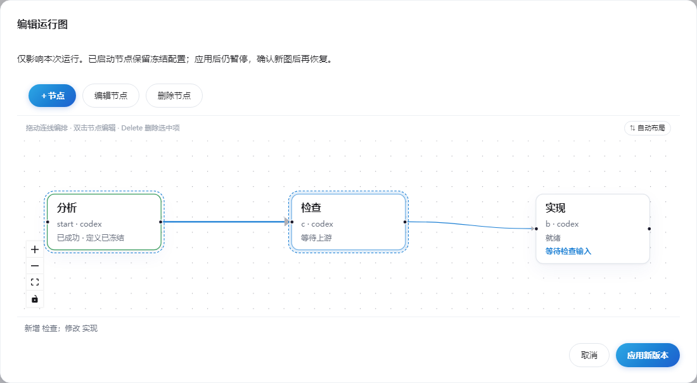

# 工作流闭环最终完成记录

日期：2026-09-09。基线：`main@86c19890be8345b46264c7631c23abf5d7d125ef` 加原有未提交实现。

本次直接接手完成剩余实现与验收，没有继续委派，也没有 commit/push。原有分析、修订报告和探针保留为历史材料；当前使用方式以 [README](../../README.md) 为准。

## 用户三项要求

| 要求 | 完成结果 |
| --- | --- |
| 工作流编排、每个节点有自己的职责 | 节点独立选择 Agent，编辑职责、验收说明、输出约束和输入映射；输出要求进入实际 prompt，并在成功结算前验证 |
| 动态改变节点图 | 工作流编辑、运行图展示和暂停后的运行图编辑共用画布与节点表单；支持增删节点、连线、断线、布局和整图补丁；已启动节点保留完整冻结定义 |
| 节点间 prompt 可视化、可编辑 | 编辑阶段使用 Core 试算嵌套示例 Handoff；运行中查看模板、解析值、来源、本次业务 prompt 和协议；输入门控支持补值、修改、版本确认和只读发送记录 |

连线说明包括直接映射、间接祖先引用和旧工作流自动携带的祖先摘要，能区分纯控制依赖；选中字段可高亮路径。

## 本次收尾的主要实现

- 共享图与表单：[GraphCanvas](../../web/src/workbench/graph_canvas.tsx)、[节点表单](../../web/src/workbench/node_form.tsx)、[运行图编辑器](../../web/src/workbench/run_graph_editor.tsx)、[图语义](../../web/src/dag/workflow_graph.ts)。项目工作流和运行图分别提交各自的 Core 命令，前端不接管调度状态。
- Core 统一试算/渲染：[node_input.rs](../../crates/mf-agent/src/node_input.rs)。支持真实嵌套 JSON、nodes/inputs 引用、缺失诊断及输出约束。示例不落库、不进入正式覆盖或发送记录；协议版本随输入保存，旧无版本记录保留 v1 解释。
- 输入在 attempt 之前准备并持久化；缺失必填项进入可补值的等待状态，确认前不消耗 attempt。输入与 Agent Run 在同一事务关联，存储失败不允许无记录派发。
- 派发复验当前活动 Revision、暂停和输入版本；手工/自动重试及跳过不意外恢复暂停。其他分支需要人工介入时，独立分支仍可继续。
- 编辑中的输入草稿固定版本，冲突显式处理。结算被输出约束拒绝后，表单允许纠正再提交。工作流编辑完成后同步版本再回到启动入口；运行详情无需页面重载即可更新。
- 冻结实例、依赖顺序和历史输入归属继续保留；已取消运行不残留人工检查提醒。
- 修复全量测试暴露的实际启动缺陷：旧子步骤 ID 派生会与主命令 ID 碰撞，引发偶发补偿回滚。新启动使用带版本的独立派生；旧持久 Operation 按原版本恢复。已增加确定性复现与兼容测试。
- 真实重启测试改为明确检查 Core 的 attempt 和 Agent Run 数量，补齐已确认未派发及 A→C→B 图补丁提交后硬重启场景。
- S2 组件检查迁入正常 [UI 测试脚本](../../web/scripts/ui-tests.mjs)，不再把历史研究探针作为 CI 依赖。README、CONTEXT 与 ADR 0006 已同步。

## 最终实际验证

| 检查 | 结果 |
| --- | --- |
| `cargo fmt --all -- --check` | 通过 |
| `cargo check --workspace --tests` | 通过 |
| `RUST_TEST_THREADS=1 cargo test --workspace` | **1125 passed / 0 failed** |
| `web/ npm test` | **61 passed / 0 failed** |
| `web/ npm run build` | 通过 |
| `web/ npm run e2e` 主套件 | **11/11 通过** |
| 同一 e2e 命令中的真实进程重启套件 | **3/3 通过** |
| 同一 e2e 命令中的组件检查 | **2 项通过** |
| `git diff --check` | 通过 |

Rust 另有两个按仓库原约定忽略的基线生成工具：`regenerate_baseline_fixtures` 与 `regenerate_workflow_goldens`。它们会覆写已提交的 fixtures，不属于未执行的功能测试。

E2E 使用本次构建的独立测试 Core，二进制 SHA-256：`BDA1B4E296922A18DB395EBE88266EC2D305A06C3BE2AE1ED3C3462D957935A9`。为避免 Windows 下运行文件锁与编译冲突，从构建产物复制到临时测试路径；源码和行为未替换为模拟 Core。

整套验收通过后，运行图按宽屏编辑空间采用横向布局，并清除已删除连线的旧说明；该视觉收口已另外通过图补丁硬重启用例，截图已人工查看。

## 关键端到端证据

1. **模板试算隔离：**编辑未保存节点，填写嵌套 `output.nested.path` 示例并试算；工作流快照和运行数量不变。正式运行随后使用 `ACTUAL_REPORT.md`，没有把 `SAMPLE_ONLY.md` 混入发送内容。
2. **输入和结算纠错：**必填缺失等待补值；确认后单次派发。错误输出被拒绝后可修正为满足 schema 的 JSON 再结算。
3. **待确认跨重启：**硬杀再启动 Core，节点仍是零 attempt；确认后只产生一次执行。
4. **已确认未派发跨重启：**暂停期间确认输入，读取 Core 证明 attempt 为零；重启后仍暂停且已确认，恢复后只派发一次。
5. **图补丁跨重启：**A 完成、B 未启动，暂停后插入 C 形成 A→C→B；应用后硬重启，活动 Revision 保持。恢复只运行 C/B，二者都能引用 A 的原始结果，最终 A/B/C 各一次、总计三个 Agent Run。

测试使用 mock Agent 验证编排与输入交付，不调用付费模型；Rust 另覆盖真实存储、Core 命令、适配器、会话和临时 worktree 契约。界面显示的是本次发送输入，CLI 自身的系统配置和复用会话历史仍由 CLI 管理。

## 状态与范围

本次 T0–T6 工作流闭环及前述返修已收口。默认生产单例保持不变，验收实例隔离运行，日常 Core 没有被停止。没有替换用户日常运行的 release 程序；源代码、构建产物和验收记录保留在本地。

循环、远程主机、mfctl 的输入编辑命令和 Agent 自主批准改图仍按既定范围作为后续扩展，不影响本次三项要求的闭环。编译仍有既有 warning 和 Vite 包体积提示，未把这些提示误写为检查失败或功能验收缺口。
